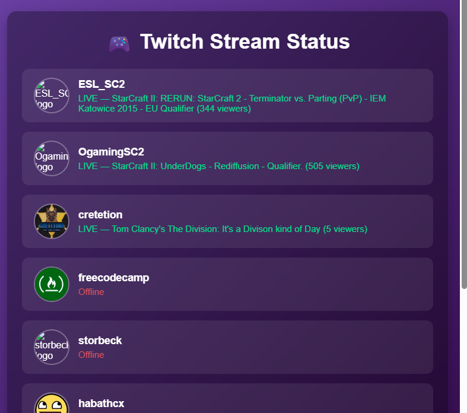

# 🎮 Twitch Stream Status App

A sleek, modern **Twitch Streamer Status Dashboard** built with **React + Vite**.  
It fetches live/offline data for selected Twitch channels using the FreeCodeCamp Twitch proxy API and displays them in a responsive, glass-styled interface.

---

## ⚡ Features

- 🔴 **Real-Time Stream Status** — Shows whether each streamer is live or offline  
- 🎨 **Modern Glassmorphic UI** — Stylish cards with hover effects and smooth transitions  
- 📱 **Fully Responsive** — Works seamlessly on mobile, tablet, and desktop  
- ⚛️ **React Hooks** — Clean and efficient component-based architecture  
- 🔗 **Direct Twitch Links** — Jump straight to any live streamer’s channel  
- 💡 **Loading State & Error Handling** — Better user experience during API calls

---

## 🚀 Live Demo

[🔗 View Live App](https://twitch-status-app.vercel.app/) 

---

## 🖼️ Screenshots



---

## 🛠️ Built With

- ⚛️ [React](https://react.dev/) – Front-end library  
- ⚡ [Vite](https://vitejs.dev/) – Lightning-fast build tool  
- 🎨 **CSS3** – Glassmorphic design and responsiveness  
- 🌐 **Fetch API** – For retrieving Twitch data  
- 📡 [FreeCodeCamp Twitch Proxy API](https://twitch-proxy.freecodecamp.rocks/) – To bypass CORS issues

---

## 📁 Project structure
```bash
twitch
├── README.md
├── eslint.config.js
├── index.html
├── package-lock.json
├── package.json
├── public
│   ├── screenshot.png
│   └── vite.svg
├── src
│   ├── App.jsx
│   ├── components
│   │   ├── StreamCard.jsx
│   │   └── StreamList.jsx
│   ├── index.css
│   └── main.jsx
└── vite.config.js
```
---
## 📦 Installation & Setup

```bash
# 1. Clone the repository
git clone https://github.com/Stabat47/twitch-status-app.git

# 2. Navigate into the project folder
cd twitch-status-app

# 3. Install dependencies
npm install

# 4. Start the development server
npm run dev
```
Open your browser at [http://localhost:5173](http://localhost:5173) to view the app.

---
## ⚙️ Usage

1. Launch the app

2. The dashboard automatically loads the predefined list of Twitch streamers

3. Click on a streamer’s name to open their Twitch channel in a new tab

4. The UI highlights **LIVE** streams in green and offline ones in red

---

## 🔧 Customization

- To add or remove streamers, edit the streamers array in App.jsx:
```javascript
const streamers = [
  "ESL_SC2",
  "freecodecamp",
  "RobotCaleb",
  // add more usernames here
];
```
---

## 🙌 Acknowledgments

- Inspired by FreeCodeCamp’s Twitch API project

- API powered by [FreeCodeCamp Twitch Proxy](https://twitch-proxy.freecodecamp.rocks/)

- Design inspiration from **glassmorphism UI trend**

- Emojis by [EmojiPedia](https://emojipedia.org/)

---

## 📝 License

This project is licensed under the **MIT License** — you’re free to use, modify, and distribute it.

---

## 👤 Author

**Landoh Clansy**

GitHub: [@Stabat47](github.com/Stabat47)
